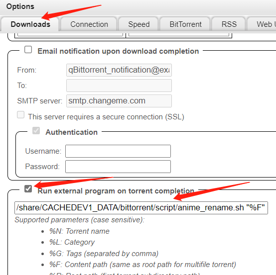

# Anime Renamer Script

The Anime Renamer Script is a shell script that facilitates the renaming and organization of anime files downloaded via qbittorrent. The script targets anime files and is designed to work with filenames that follow a specific format.

## Requirements

- qbittorrent
- Shell environment (Linux, macOS, or Unix-based system)

## Usage

1. Download the `anime_renamer.sh` file.
2. move the script to the same server of qbittorrent
3. Ensure that the script has executable permissions by running the following command: 

    ```
    chmod +x anime_renamer.sh
    ```

4. check mark the run external program on torrent completion and add following command: 
    

    ```
    /path/to/anime_renamer.sh "%F" "%I"
    ```

   This will trigger the script after the anime is downloaded

## Naming Convention

The Script is designed to work with anime files that follow the following naming convention: 


Naming Convention
The Anime Renamer Script is designed to work with anime files that follow the following naming convention:

```bash
[${subtitle group}] ${show name} ${season}${episode} ${meta}.${format}
```
The script creates a subdirectory within the original video save path and moves the renamed file into the subdirectory. The renamed file follows this naming convention:

```bash
${show name} S${season}E${episode} ${meta}.${format}
```
In the new filename, the show name is converted to lowercase, all special characters are removed, and spaces are replaced with underscores. If the season is missing, it defaults to S01. The [] brackets around the meta information are also removed.

example:

```
/save/path/[Lilith-Raws] Kimetsu no Yaiba - Katanakaji no Sato-Hen - 01 [Baha][WEB-DL][1080p][AVC AAC][CHT][MP4].mp4
```
will be moved to:
```
/save/path/kimetsu_no_yaiba__katanakaji_no_satohen/Kimetsu no Yaiba - Katanakaji no Sato-Hen S01E01 Baha WEB-DL 1080p AVC AAC CHT MP4.mp4
```


Additional Information

To ensure that the files can still be seeded after they are renamed and relocated, the qbittorrent renameFile API is used instead of the simple mv command.
